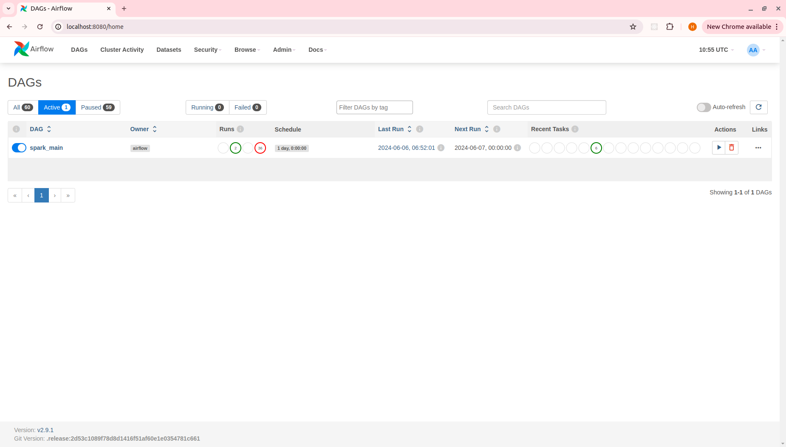
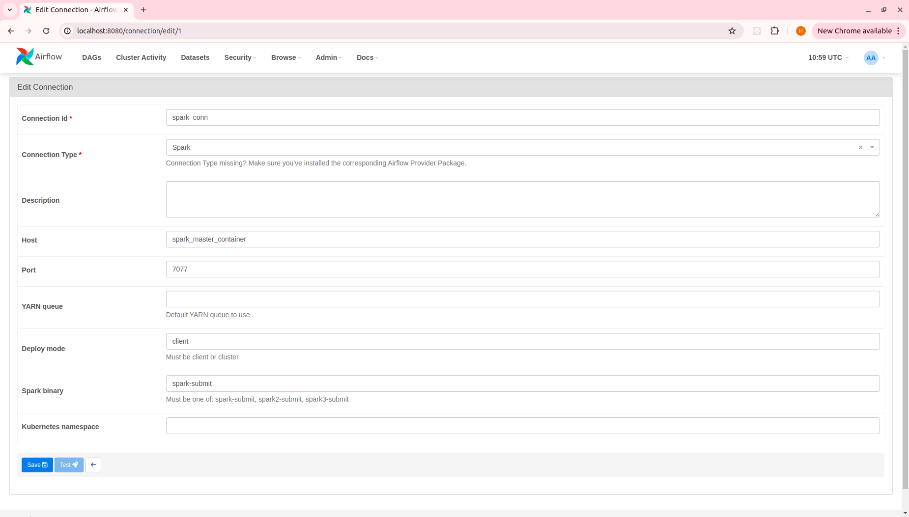
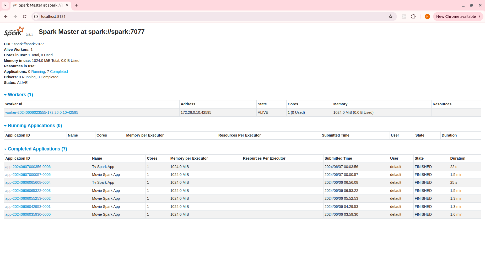
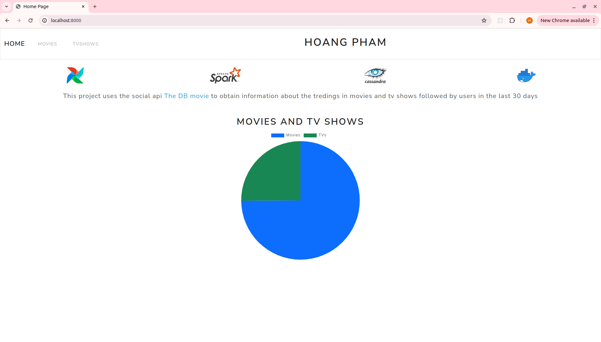
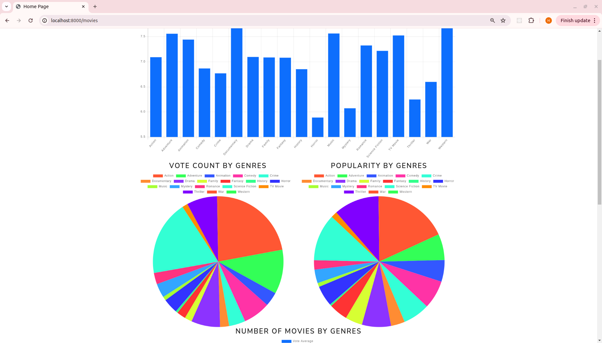
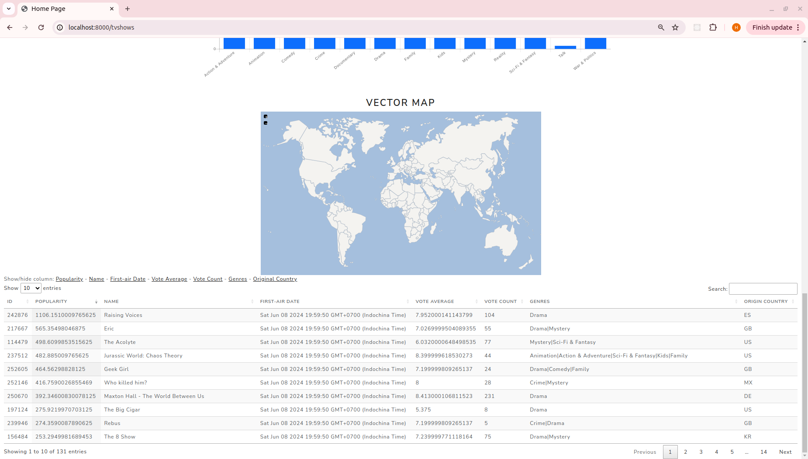
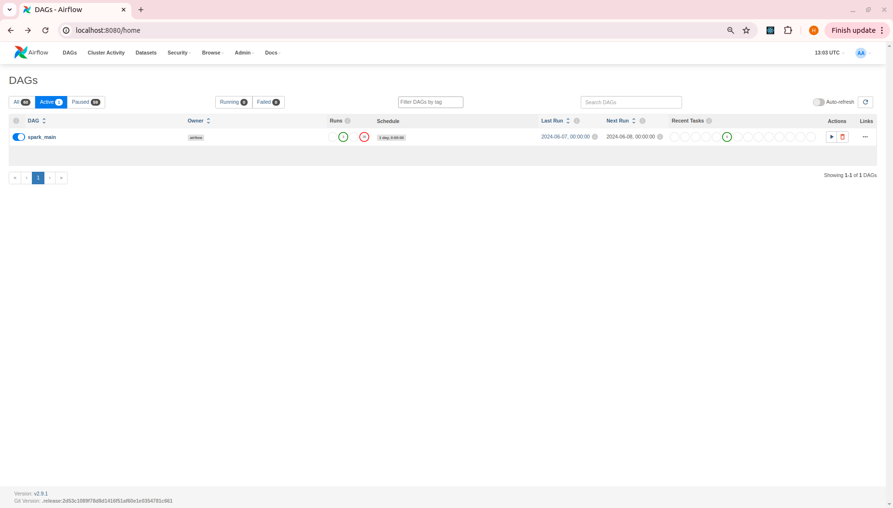

# Extraction, transformation, loading and visualization of The DB movies API data in a scalable architecture


## Overview
This repository uses the DB movies API to obtain information about the latest Movies and TV shows in the last 30 days. The entire process is managed using widely recognized tools within the field of Big Data.


## Description
This project implements a **ETL process** to collect data from The DB movies. The steps of the process are:
1. The **The DBmovies** is consulted to gather the list of movies and TV shows in the last 30 days. 
2. The **movies** and **TV shows** are cleaned up, the genres_id transform to genres_name, so does original_countries.
3. The data is formatted and stored in a **.csv** file.
4. Clean **Cassandra** daily and uploaded the latest data to it. The .csv is stored as a history file in the folder named date.
5. The data served from Cassandra is requested by the **back-end** and served on the **front-end**.
6. The data incluing bar chart, pie chart, vector maps, table of data will be displayed to **user** on the front-end.

The project has been built using **Docker** and **Docker Compose** to run the following containers
- **Apache Airflow** containers configured for flow orchestration: websever, scheduler, worker, init, trigger, redis, postgres, client, and flower. Airflow setup required a custom image with the following packages installed via PyPI in addtional requirements. In addition, in the Airflow Dockerfile, the JAVA JDK 17 was installed and the JAVA_HOME variable set in order to combine to **Apache Spark**. The image used as base image is the official Airflow image in latest version (2.9.1) found on [Dockerhub](https://hub.docker.com/r/apache/airflow), this image will be customed in [Dockerfile](./docker/airflow/Dockerfile) and added the additional configuration on [the Docker Compose base file](https://airflow.apache.org/docs/apache-airflow/2.9.1/docker-compose.yaml) from **Apache Airflow**.
- **Apache Spark** containers were configured for data processing including one node master and one node worker. Spark setup required a custom image with the following packages installed via PyPI. The image inherits from the base image Bitnami Spark image in latest version (3.5.1) obtained from [Dockerhub](https://hub.docker.com/r/bitnami/spark).
- An **Apache Cassandra** container was configured for data storage, usign an additional container to set up the database configuration. The image used was the official Cassandra in the latest version (5.0) and found on the [Dockerhub](https://hub.docker.com/_/cassandra) and no additional requirements were needed.
- A **Flask** container was configured for the web application. The container requried a custom image with the following packages isntalled via PyPI as additional requirements: flask (v2.1.2), cassandra-driver (v3.25.0), flask-cqlalchemy(v2.0.0), redis, Cmake, crytography and requests. The image used as base image was the latest official Python image (version 3.12) found on [DockerHub](https://hub.docker.com/_/python).


## Prerequisites
- **Git**
- **Docker**
- **Docker-compose**
- **Python**
- The DBmovies APIs **developer keys**
> The correct operation of the project with different versions is not guaranteed.


## How to use my code 
**Clone** the project, make sure that the "airflow/logs", "airflow/plugins", and "spark/resources" folders are set with the correct permissions so that Airflow can edit them, and run **docker-compose up** in the command console:
```
$ git clone https://github.com/HoangPham10/FilmTrendDataEngineer.git

$ cd FilmTrendDataEngineer

$ sudo chmod -R 777 airflow/logs
$ sudo chmod -R 777 airflow/plugins
$ sudo chmod -R 777 spark/resources

$ sudo docker compose up airflow-init
$ sudo docker compose up -d

```

> The commands described for the installation and usage of the project are oriented to Linux environments.

Once the project is deployed, three visual interfaces can be accessed that can help the user to better understand the process:
1. **Apache Airflow user interface.** It is accessible through port [8080](http://localhost:8080), user: 'airflow', password: 'airflow', and allows access, among other things, to the Airflow configuration and the list of configured DAGs, being able to observe their instances and obtain metrics such as execution times. </br>
 
</br>
You have to create a connections in **Admin/Connections** as the image below:</br>


2. **Apache Spark user interface.** It is accessible through port [8181](http://localhost:8181) and allows to observe the master node and the worker, as well as their last tasks performed. </br>



3. **Front-end user interface** It is accessible through port [8000](http://localhost:8000) and contains three views:
    1. **Home.** It shows a brief introduction of the project and disrtibution of movies and tv shows in a pie chart.</br>
        
    2. **Movies visual and data tables.** It displays two pie charts about vote count and popularity group by genres, and two bar charts about the average vote and the number of movies group by genres. It followed by a table of fulldata. </br>
        

    3. **TV shows visual and data tables.** It displays two pie charts about vote count and popularity group by genres, and two bar charts about the average vote and the number of movies group by genres and a map vector show the number of movies group by country. It followed by a table of fulldata. </br>
        
    
    
    After the services are running, access to the **Airflow UI** and activate the DAG "**spark_main**". After all the tasks are executed correctly, the data will be displayed in the web application views. If not paused, the DAG will be executed daily. </br>
        

 
To **stop** the project, run the following command within the docker folder:
```
$ sudo docker-compose down
```

To completely **reset** the project, run the following command within the docker folder:
```
$ sudo docker-compose down -v
```
